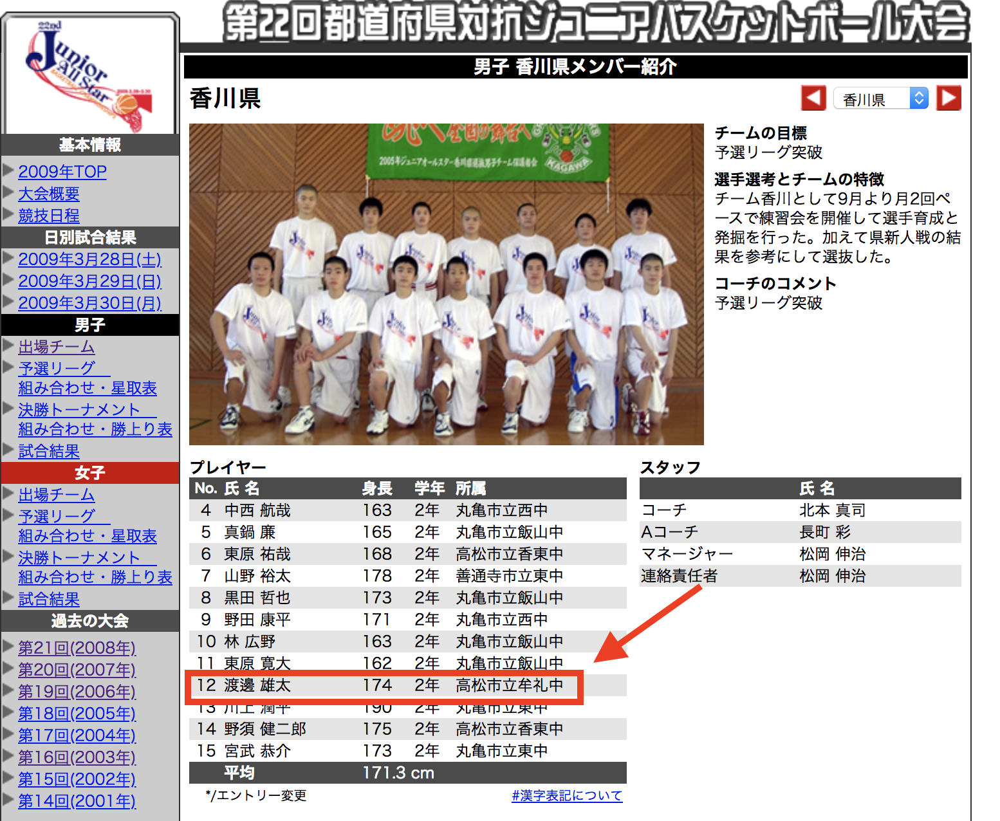
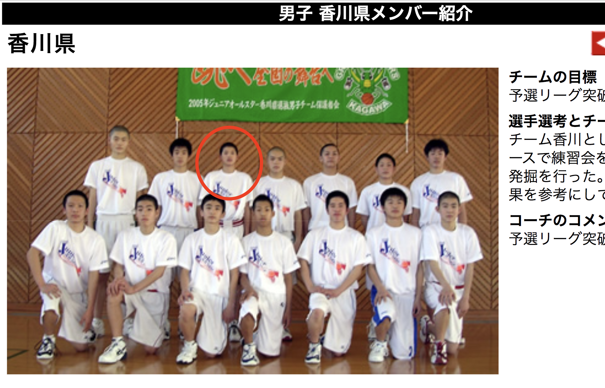
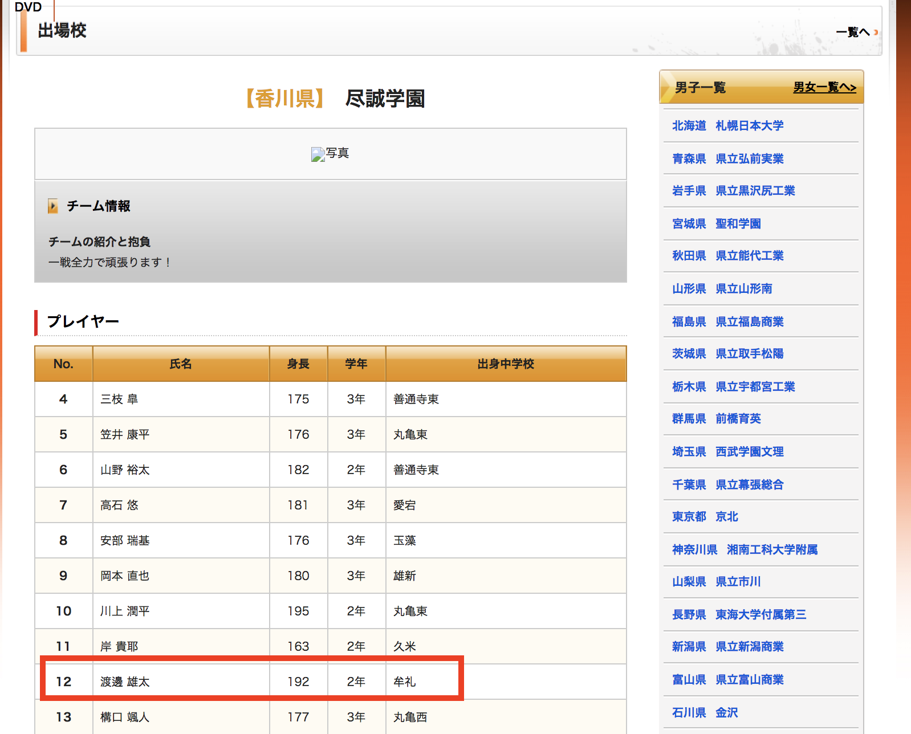
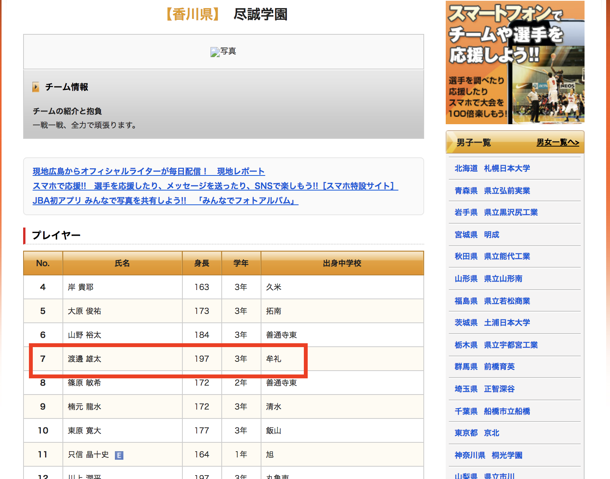
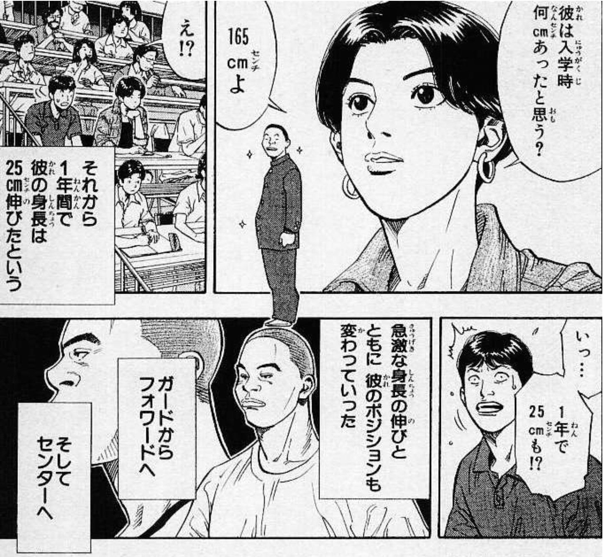
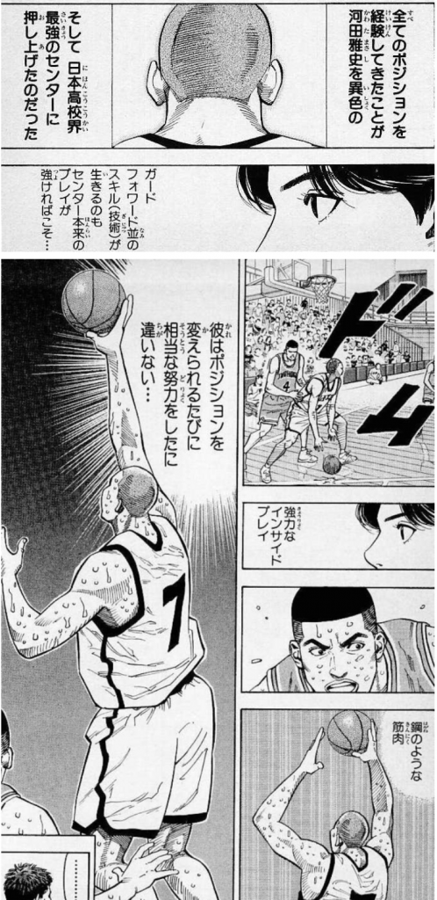

メンフィスグリズリーズと2Way契約を結び、プレシーズンゲームにも出場し、NBAデビュー目前の渡邊雄太選手。

今は206cmある身長ですが、実は中学2年生の時は174cmだったんです。

ちなみに、中学入学時は160cmとのこと（月刊バスケットボール2019年6月号より）

ガードとして、ジュニアオールスターというバスケの中学生の全国大会に香川県代表として出場しています。

 

引用元：
http://juniorallstar.japanbasketball.jp/2009/team_d.html?mw=1&teamno=138

 

おそらく渡邉選手はこちら

 

牟礼中学校から尽誠学園高等学校に進学されますが、高校入学時は190cmらしいです。（月刊バスケットボール2019年6月号より）

高校2年(17歳)の時に出場したウィンターカップ2011の時は、、192cm

 

引用元：
http://www.japanbasketball.jp/wintercup/2011/team_detail-php-team_id=100485&event_id=118.html

 

高校3年(18歳)の時に出場したウィンターカップ2012の時は、、197cm

引用元：
http://www.japanbasketball.jp/wintercup/2012/team_detail-php-team_id=101117.html

 

そして、現在2018年(23歳)206cm

まとめると、、

13歳：160cm

14歳：174cm

16歳：190cm

17歳：192cm

18歳：197cm

23歳：206cm(ウィングスパンは208cm)

 

中学生の頃にガードをやっていて、そこから急激に身長が伸びてセンターになったって、スラムダンクの河田雅史と同じですね。

まさにこのシーン

 

私は渡邊雄太選手が高校2年、3年の時の尽誠学園vs延岡学園の試合を観たですが、第一印象は、、

「細っ!!」

でした。

むちゃくちゃ細かったです。

当時観た時は才能があるのはもちろん、よく走り、献身的なプレーをしていたのが印象でした。

中学でガードやっていて、そこから急激に身長が伸びてセンターになった、という話だけ聞くと、

「運がいい」

で、自分は真似できない、で終わってしまいますが、

今のあの身体付きとディフェンスのサイドステップを観ると、相当努力されていることが伺えます。

スラムダンクの河田雅史もポジションが変わる度に相当努力したに違いない、というくだりがありましたが、

このシーンですね。

 

渡邉選手もアメリカに渡って、相当努力したに違いありません。

NBAデビューが目前で、1ファンとしては、レブロン・ジェームスやステフォン・カリーと同じコートに立つ姿を早く観てみたいですが、

焦らず、怪我せずじっくりNBAに適応していってくれたらな〜と、祈るばかりです。

グリズリーズが2Way契約を結んだのも、今の実力だけではなく、ハードに練習して、うまくなる努力家タイプであることを見抜いたからだと思うんですよね。

以上になります。