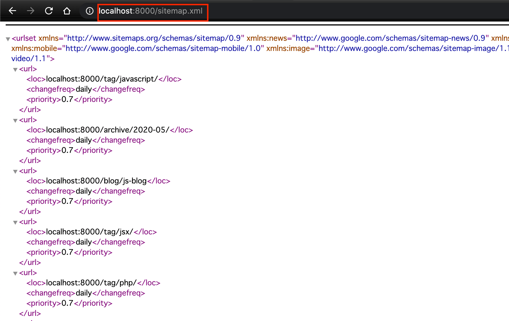
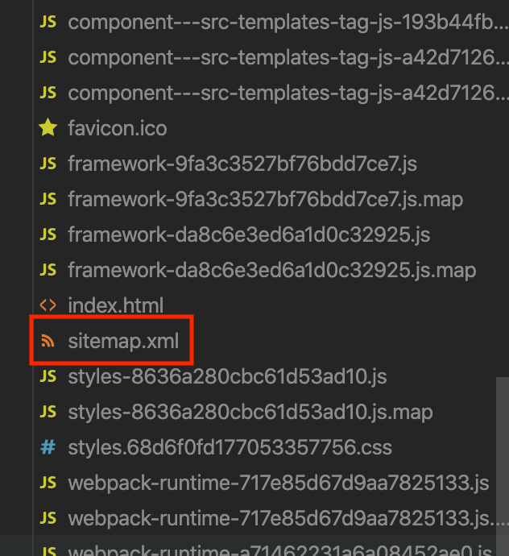

### エラー内容

Gatsbyのプラグイン "gatsby-plugin-sitemap" を追加して、sitemap.xml を出力しようとしたのですが、下記エラーになり追加できませんでした。

    Error: Cannot query field "siteUrl" on type "SiteSiteMetadata".
    GraphQL request:5:11
    4 |         siteMetadata {
    5 |           siteUrl
    |           ^
    6 |         }

### 対処法

gatsby-config.js の siteMetadata に siteUrl を追記することでエラーは解消されました。

修正前

    siteMetadata: {
        title: 'nobuhiroharada.com',
        author: 'Nobuhiro Harada'
    },

修正後

    siteMetadata: {
        title: 'nobuhiroharada.com',
        author: 'Nobuhiro Harada',
        siteUrl: 'localhost:8000'
    },

これでビルドすると、ブラウザでsitemap.xmlが確認できました。

出力先のpage-dataフォルダ直下にsitemap.xmlが出力されています。

以上になります。

### 参考
Issues with Sitemap plugin integration

https://github.com/gatsbyjs/gatsby/issues/2407#issuecomment-495950517

Gatsby公式サイト　サイトマッププラグイン追加手順
https://www.gatsbyjs.org/docs/creating-a-sitemap/