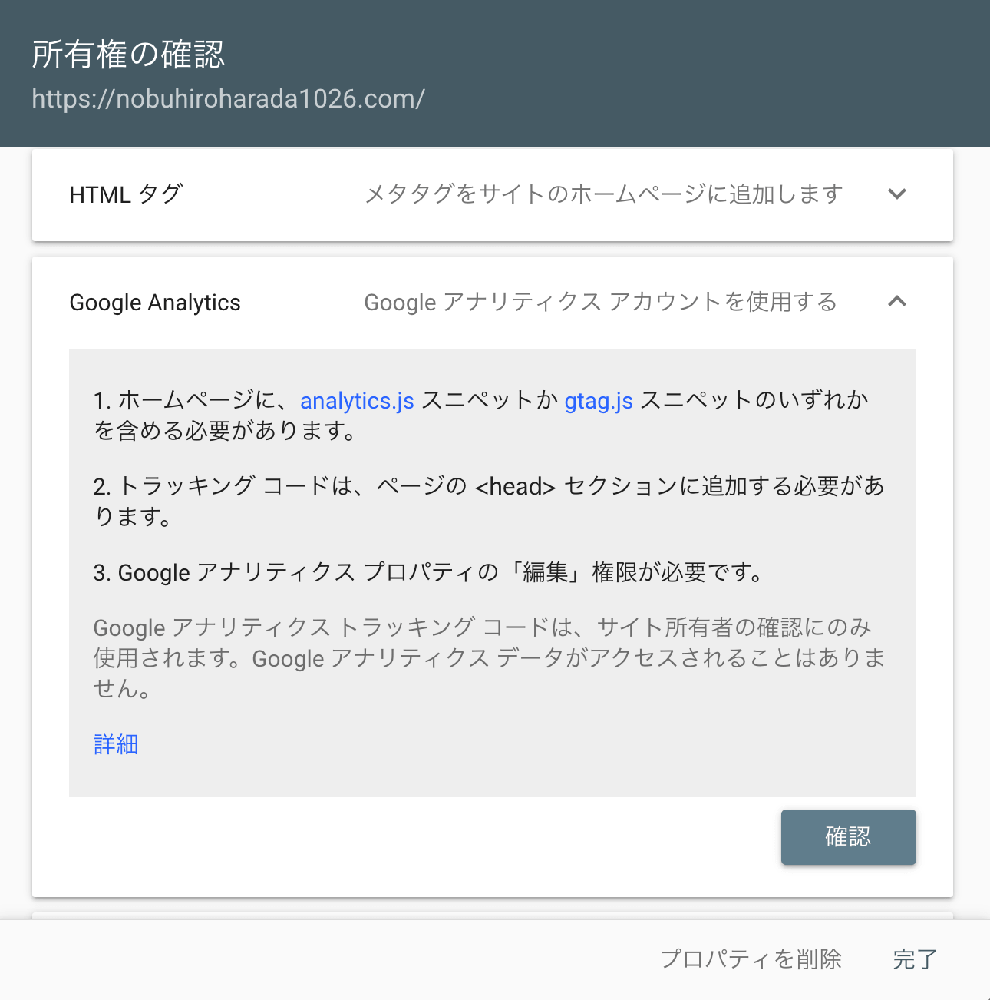

### 前提条件

Google Analyticsのプラグイン、'gatsby-plugin-google-analytics' を使用

### 登録方法

gatsby-config.js の options に head: true を設定します。

**修正前**

    {
        resolve: `gatsby-plugin-google-analytics`,
        options: {
            trackingId: "UA-XXXXXXXXX-X",
        },
    },

**修正後**

    {
        resolve: `gatsby-plugin-google-analytics`,
        options: {
            trackingId: "UA-XXXXXXXXX-X",
            head: true
        },
    },

登録後、Google Search Consoleからプロパティの追加 -> プロパティの選択 -> 所有権の確認 で Google Analytics を選択します。

これで Google Search Console に登録され、サイトマップの追加などができるようになります。

以上になります。

**参考**

Add a Gatsby site to the Google Search Console with Google Analytics
https://vincentdnl.com/add-gatsby-site-to-google-search-console-with-google-analytics/